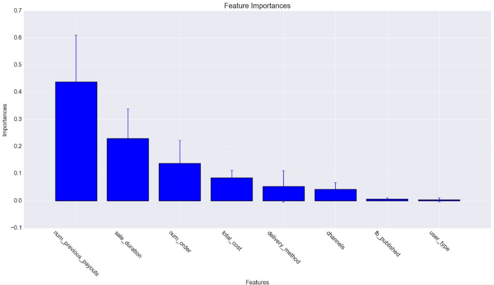

# FraudDetection

# What is this repo for?
This is a Flask based web app that streams EventBrite events and detects fraudulent ones. Unfortunately, you won't be able to see the raw data that we used to train our model, but you can access the model from the <b>model.pkl</b> file. I developed this with a team as a Case Study for the Galvanize Data Science Immersive.

# What was the process
In one day we cleaned up a fairly messy data set, removing colinearity and overly-sparse columns. We then built a Gradient Boosted Tree and Random Forest Model. The higher performing of these models was the Random Forest. With this model, we achieved 98.8% accuracy and 91.1% recall. We used these results to calculate feature importance, to develop a deaper intuition for our data.

The next day we used these results to build a Flask based web app to stream new eventbrite events and flag potential fraud.

# Tool Kit
<ul>
<li> Python
<li> Pandas
<li> Numpy
<li> Sci-Kit Learn
<li> Seaborn
<li> Matplotlib
<li> Flask
</ul>

# Results
If you are interested in seeing the results we achieved check out <b>Fraud Detection Case Study.pdf.</b>
